# Semantic 3D Retail Shelf Analytics

**End-to-End Pipeline: Novel View Synthesis & Semantic 3D Reconstruction for Retail Intelligence**

This repository tracks the full engineering lifecycle of a retail AI system that replaces fragile 2D image-stitching methods with a volumetric 3D reconstruction backbone — enabling automated, occlusion-robust shelf analytics (OOS detection, planogram compliance, SKU recognition) powered by a self-generating synthetic data factory.

---

## Table of Contents

1. [Project Overview](#project-overview)
2. [Pipeline Architecture](#pipeline-architecture)
3. [Step-by-Step Roadmap](#step-by-step-roadmap)
   - [Step 1 — Data Collection & 2D Semantic Extraction](#step-1--data-collection--2d-semantic-extraction)
   - [Step 2 — Robust Camera Pose Estimation (SfM)](#step-2--robust-camera-pose-estimation-sfm)
   - [Step 3 — Semantic 3DGS Training & Optimization](#step-3--semantic-3dgs-training--optimization)
   - [Step 4 — Synthetic Data Factory (Rendering Pipeline)](#step-4--synthetic-data-factory-rendering-pipeline)
   - [Step 5 — Downstream Model Training & Deployment](#step-5--downstream-model-training--deployment)
4. [Key Repositories](#key-repositories)
5. [Papers to Read](#papers-to-read)
   - [Core 3DGS & NeRF Foundations](#-core-3dgs--nerf-foundations)
   - [Semantic Scene Understanding in 3D](#-semantic-scene-understanding-in-3d)
   - [Structure-from-Motion & Camera Pose](#-structure-from-motion--camera-pose)
   - [Synthetic Data Generation](#-synthetic-data-generation)
   - [Retail Analytics & Downstream Applications](#-retail-analytics--downstream-applications)
6. [Hardware & Software Requirements](#hardware--software-requirements)
7. [Directory Structure](#directory-structure)
8. [Progress Tracker](#progress-tracker)

---

## Project Overview

Modern retail shelf analytics has hit a structural ceiling with 2D feature-matching and image-stitching pipelines. Repeating product patterns, extreme parallax, and occlusion make these systems brittle at scale.

**This project implements a 5-step volumetric intelligence pipeline:**

```
Real-World Video  ──►  Camera Poses (SfM)  ──►  Semantic 3DGS Model
                                                        │
                                               Synthetic Data Factory
                                                        │
                                          Production YOLO / Detection Models
```

The core insight: treat the 3D Gaussian scene not just as a visualization tool, but as a **zero-cost, automatically annotated synthetic data generator**. A single real-world capture session produces infinite training variations — different angles, lighting, partial occlusions — all with pixel-perfect ground-truth labels derived mathematically from the 3D representation.

**Target capabilities:**
- Out-of-Stock (OOS) detection in milliseconds
- Planogram compliance verification
- SKU-level instance segmentation from any camera angle
- Automatic retraining when new products are introduced (few-shot → 3D → thousands of synthetic samples)

---

## Pipeline Architecture

```mermaid
graph LR
    A[📷 Shelf Video\n4K 60fps + CPL Filter] --> B[🔑 Keyframe Extraction\n10–20% sampling]
    B --> C[🎭 SAM / YOLO\nZero-shot Instance Masks]
    C --> D{SKU ID Assignment}
    D --> E[🗺️ SfM / GLUEMAP\nCamera Pose Estimation]
    E --> F[☁️ Sparse Point Cloud]
    F --> G[🫧 3DGS Initialization\nGaussian Ellipsoids]
    C --> G
    G --> H[🏷️ Gaussian Grouping\n16-dim Identity Encoding]
    H --> I[✅ Semantic 3D Scene\nDigital Twin]
    I --> J[🎬 Virtual Camera Rendering\nDual Output: RGB + Mask]
    J --> K[📦 Synthetic Dataset\nTens of Thousands of Annotated Frames]
    K --> L[🤖 YOLO / Detector Training\nReal + Synthetic Mix]
    L --> M[🚀 Edge Deployment\nStore Cameras / Robots]
```



---

## Step-by-Step Roadmap

### Step 1 — Data Collection & 2D Semantic Extraction

**Goal:** Capture high-quality shelf video and produce sparse semantic seed labels.

| Task | Method | Notes |
|------|--------|-------|
| Video capture | 4K 60fps, gimbal-stabilized | Short exposure to minimize motion blur |
| Lens filter | Circular Polarizing (CPL) | Eliminates shelf reflections critical for SfM |
| Keyframe extraction | Sample 10–20% of frames | Sufficient density for reconstruction |
| Instance segmentation | SAM (zero-shot) or pre-trained YOLO | Applied only to keyframes |
| SKU ID assignment | Manual or barcode-assisted labeling | Map mask → real-world product ID |

**Output:** Sparse set of keyframes with pixel-accurate instance masks and SKU identities.

---

### Step 2 — Robust Camera Pose Estimation (SfM)

**Goal:** Recover accurate 6-DoF camera poses for every captured frame.

| Scenario | Recommended Pipeline | Why |
|----------|----------------------|-----|
| Accuracy-first (static setup) | **GLUEMAP** (SALAD → MAST3R → COLMAP BA) | Eliminates false matches from repeating shelf patterns |
| Speed-first (edge / real-time) | **MV-DUSt3R+** | No pre-calibration needed; 2-second sparse reconstruction |
| Fallback / validation | **COLMAP** vanilla | Well-established baseline |

> ⚠️ Avoid vanilla COLMAP alone on retail corridors — repeating product textures cause frequent rotation drift.

**Output:** Camera intrinsics/extrinsics + sparse 3D point cloud.

---

### Step 3 — Semantic 3DGS Training & Optimization

**Goal:** Build a semantically-labeled, manipulable 3D scene — the "digital twin" of the shelf.

**Architecture: Gaussian Grouping**

Each 3D Gaussian primitive receives:
- Standard geometric parameters (position, scale, rotation, opacity, color/SH coefficients)
- A **16-dimensional Identity Encoding vector**

During differentiable rasterization, the 2D identity projections are supervised against the sparse SAM masks using:

$$\mathcal{L}_{total} = \mathcal{L}_{rgb} + \lambda_1 \mathcal{L}_{2D\text{-identity}} + \lambda_2 \mathcal{L}_{3D\text{-KNN}}$$

- $\mathcal{L}_{2D\text{-identity}}$: contrastive loss aligning projected identities to ground-truth masks
- $\mathcal{L}_{3D\text{-KNN}}$: spatial regularizer ensuring neighboring Gaussians share identities

**Training time:** ~15–30 minutes on a single A100/H100 GPU.

**Output:** Each product on the shelf is an independently addressable, semantically-labeled 3D volume.

---

### Step 4 — Synthetic Data Factory (Rendering Pipeline)

**Goal:** Generate tens of thousands of annotated training frames with zero human labor.

```python
# Conceptual rendering loop (Nerfstudio / gsplat API)
for virtual_camera_pose in sample_random_trajectories(n=10_000):
    rgb_frame    = render_gaussian_scene(scene, virtual_camera_pose, mode="rgb")
    mask_frame   = render_gaussian_scene(scene, virtual_camera_pose, mode="identity")
    bbox_2d      = derive_bounding_boxes_from_mask(mask_frame)
    save(rgb_frame, mask_frame, bbox_2d)
```

**Key advantage:** Z-buffer depth ordering in 3DGS ensures mathematically correct occlusion masks — even when one product is partially hidden behind another. No human annotator can match this accuracy.

**Augmentation strategies:**
- Random virtual camera trajectories (including impossible real-world angles)
- Simulated lighting variation via SH coefficient perturbation
- Product removal / rearrangement to simulate OOS / planogram violations

**Output:** Large-scale synthetic dataset: `{rgb_image, instance_mask, bounding_box, sku_id, camera_pose}`.

---

### Step 5 — Downstream Model Training & Deployment

**Goal:** Train production-grade detection models and deploy to edge hardware.

| Phase | Details |
|-------|---------|
| Dataset mixing | Combine synthetic frames with limited real annotated data (real-plus-synthetic strategy) |
| Base model | YOLOv8 / YOLOv11 or RT-DETR |
| Training gain | Literature reports up to **+18% mAP** improvement with synthetic augmentation |
| Quantization | INT8 / FP16 for edge deployment |
| Deployment targets | Store handheld terminals, smart cameras, autonomous shelf-scanning robots |

**Target metrics:**
- OOS detection accuracy > 95%
- Planogram compliance verification latency < 100ms per shelf segment
- Generalization across lighting conditions and camera models

---

## Key Repositories

### 3D Reconstruction & Rendering
| Repository | Description |
|------------|-------------|
| [gaussian-grouping](https://github.com/lkeab/gaussian-grouping) | Segment and edit anything in 3D — core semantic 3DGS method |
| [nerfstudio](https://github.com/nerfstudio-project/nerfstudio) | Modular NeRF/3DGS framework; rendering pipeline and API |
| [gsplat](https://github.com/nerfstudio-project/gsplat) | Efficient 3DGS CUDA kernels; drop-in for training & rendering |
| [gaussian-splatting](https://github.com/graphdeco-inria/gaussian-splatting) | Original 3DGS implementation (Inria) |

### Camera Pose Estimation
| Repository | Description |
|------------|-------------|
| [colmap/gluemap](https://github.com/colmap/gluemap) | Global SfM + feedforward reconstruction hybrid |
| [colmap/colmap](https://github.com/colmap/colmap) | Classic Structure-from-Motion and MVS pipeline |
| [dust3r](https://github.com/naver/dust3r) | DUSt3R — geometric 3D vision without calibration |
| [mast3r](https://github.com/naver/mast3r) | MASt3R — improved matching for DUSt3R |

### Segmentation & Detection
| Repository | Description |
|------------|-------------|
| [segment-anything](https://github.com/facebookresearch/segment-anything) | SAM — zero-shot instance segmentation |
| [segment-anything-2](https://github.com/facebookresearch/segment-anything-2) | SAM 2 — video-level segmentation |
| [ultralytics](https://github.com/ultralytics/ultralytics) | YOLOv8 / YOLOv11 training & deployment |

### Retail-Specific
| Repository | Description |
|------------|-------------|
| [RetailGlue](https://openaccess.thecvf.com/content/CVPR2026W/IMW/papers/Oztuner_RetailGlue_Semantic_Product-Level_Image_Stitching_for_Retail_Shelf_Panoramas_CVPRW_2026_paper.pdf) | Semantic shelf panorama stitching (CVPR 2026 Workshop) |

---

## Papers to Read

### 📐 Core 3DGS & NeRF Foundations

| # | Paper | Venue | Link |
|---|-------|-------|------|
| 1 | **3D Gaussian Splatting for Real-Time Radiance Field Rendering** | SIGGRAPH 2023 | [arXiv](https://arxiv.org/abs/2308.04079) |
| 2 | **NeRF: Representing Scenes as Neural Radiance Fields** | ECCV 2020 | [arXiv](https://arxiv.org/abs/2003.08934) |
| 3 | **NeRF: A Comprehensive Review** | — | [arXiv](https://arxiv.org/html/2210.00379v6) |
| 4 | **3DGS vs NeRF: Side-by-Side Reconstruction Comparison** | Research Square | [PDF](https://assets-eu.researchsquare.com/files/rs-7300179/v1_covered_60fc3280-68ec-47c4-ae1d-228296ea12c4.pdf) |
| 5 | **From Fields to Splats: Cross-Domain Survey of Neural Scene Representations** | — | [arXiv](https://arxiv.org/html/2509.23555v1) |
| 6 | **VCR-GauS: View Consistent Depth-Normal Regularizer for Gaussian Surface Reconstruction** | NeurIPS 2024 | [PDF](https://proceedings.neurips.cc/paper_files/paper/2024/file/fc9f83d9925e6885e8f1ae1e17b3c44b-Paper-Conference.pdf) |
| 7 | **From Chaos to Clarity: 3DGS in the Dark** | OpenReview | [Link](https://openreview.net/forum?id=lWHe7pmk7C) |

### 🏷️ Semantic Scene Understanding in 3D

| # | Paper | Venue | Link |
|---|-------|-------|------|
| 8 | **Gaussian Grouping: Segment and Edit Anything in 3D Scenes** | ECCV 2024 | [arXiv](https://arxiv.org/html/2312.00732v2) · [ECVA](https://www.ecva.net/papers/eccv_2024/papers_ECCV/papers/04195.pdf) |
| 9 | **Semantic NeRF: In-Place Scene Labelling with Implicit Representation** | ICCV 2021 | [Project](https://shuaifengzhi.com/Semantic-NeRF/) · [CVF](https://openaccess.thecvf.com/content/ICCV2021/papers/Zhi_In-Place_Scene_Labelling_and_Understanding_With_Implicit_Scene_Representation_ICCV_2021_paper.pdf) |
| 10 | **Only Semantic Information For NeRF Reconstruction** | — | [arXiv](https://arxiv.org/html/2403.16043v1) |
| 11 | **R5DGS: Semantic-Aware 4D Gaussian Splatting** | OpenReview | [PDF](https://openreview.net/attachment?id=LFHg6tcn7e&name=pdf) |
| 12 | **BEA-GS: Beyond Radiance Supervision for Precise Object Extraction** | — | [arXiv](https://arxiv.org/html/2605.09662v1) |
| 13 | **Space-Time Forecasting with Motion-aware Gaussian Grouping** | CVPR 2026 | [CVF](https://openaccess.thecvf.com/content/CVPR2026/papers/Lee_Space-Time_Forecasting_of_Dynamic_Scenes_with_Motion-aware_Gaussian_Grouping_CVPR_2026_paper.pdf) |
| 14 | **Semantic Foam: Unifying Spatial and Semantic Scene Decomposition** | CVPR 2026 | [CVF](https://openaccess.thecvf.com/content/CVPR2026/papers/Sharafeldin_Semantic_Foam_Unifying_Spatial_and_Semantic_Scene_Decomposition_CVPR_2026_paper.pdf) |
| 15 | **SLAG: Scalable Language-Augmented Gaussian Splatting** | — | [arXiv](https://arxiv.org/html/2505.08124v2) |
| 16 | **VoteSplat: Hough Voting Gaussian Splatting for 3D Scene Understanding** | ICCV 2025 | [CVF](https://openaccess.thecvf.com/content/ICCV2025/papers/Jiang_VoteSplat_Hough_Voting_Gaussian_Splatting_for_3D_Scene_Understanding_ICCV_2025_paper.pdf) |
| 17 | **Beyond Averages: Open-Vocabulary 3D Scene Understanding with Gaussian Splatting** | — | [arXiv](https://arxiv.org/pdf/2509.12938) |
| 18 | **Group Any Gaussians via 3D-aware Memory Bank** | — | [arXiv](https://arxiv.org/html/2404.07977v3) |
| 19 | **Gradient-Weighted Feature Back-Projection: Fast Alternative to Feature Distillation in 3DGS** | — | [arXiv](https://arxiv.org/html/2411.15193v1) |
| 20 | **Unsupervised Continual Semantic Adaptation Through Neural Rendering** | CVPR 2023 | [CVF](https://openaccess.thecvf.com/content/CVPR2023/papers/Liu_Unsupervised_Continual_Semantic_Adaptation_Through_Neural_Rendering_CVPR_2023_paper.pdf) |
| 21 | **Learning Semantic Fields of Dynamic Scenes from Monocular Videos** | ICLR 2024 | [PDF](https://proceedings.iclr.cc/paper_files/paper/2024/file/801ec05b0aae9fcd2ef35c168bd538e0-Paper-Conference.pdf) |
| 22 | **SG-NeRF: Neural Surface Reconstruction with Scene Graph Optimization** | — | [arXiv](https://arxiv.org/html/2407.12667v1) |

### 🗺️ Structure-from-Motion & Camera Pose

| # | Paper | Venue | Link |
|---|-------|-------|------|
| 23 | **GLUEMAP: Global Structure-from-Motion Meets Feedforward Reconstruction** | CVPR 2026 | [GitHub](https://github.com/colmap/gluemap) · [Project](https://lpanaf.github.io/cvpr26_gluemap/) |
| 24 | **DUSt3R: Geometric 3D Vision Made Easy** | CVPR 2024 | [arXiv](https://arxiv.org/html/2312.14132v1) · [Semantic Scholar](https://www.semanticscholar.org/paper/DUSt3R%3A-Geometric-3D-Vision-Made-Easy-Wang-Leroy/5f82a81766cb78395a55b8fc697c2421a20f4a9e) |
| 25 | **MV-DUSt3R+: Single-Stage Scene Reconstruction from Sparse Views in 2 Seconds** | CVPR 2025 Oral | [Project](https://mv-dust3rp.github.io/) |
| 26 | **COLMAP-Free 3D Gaussian Splatting** | CVPR 2024 | [CVF](https://openaccess.thecvf.com/content/CVPR2024/papers/Fu_COLMAP-Free_3D_Gaussian_Splatting_CVPR_2024_paper.pdf) · [arXiv](https://arxiv.org/html/2312.07504v1) |
| 27 | **CT-NeRF: Incremental Optimizing NeRF and Poses with Complex Trajectory** | — | [arXiv](https://arxiv.org/html/2404.13896v2) |
| 28 | **Fast Intrinsic–Extrinsic Calibration for Pose-Only SfM** | Remote Sensing 2025 | [MDPI](https://www.mdpi.com/2072-4292/17/13/2247) |
| 29 | **Assessing COLMAP, DROID-SLAM, and NeRF-SLAM in 3D Road Scene Reconstruction** | Thesis | [PDF](https://lup.lub.lu.se/student-papers/record/9127302/file/9127313.pdf) |
| 30 | **Object-Centric Pose Estimation by Scale Alignment of Ray Diffusion and ICP** | Applied Sciences | [MDPI](https://www.mdpi.com/2076-3417/16/13/6624) |

### 🏭 Synthetic Data Generation

| # | Paper | Venue | Link |
|---|-------|-------|------|
| 31 | **Cut-and-Splat: Leveraging Gaussian Splatting for Synthetic Data Generation** | — | [arXiv](https://arxiv.org/html/2504.08473v1) |
| 32 | **Synthetic Dataset Generation for Autonomous Mobile Robots Using 3DGS** | — | [arXiv](https://arxiv.org/html/2506.05092v1) |
| 33 | **Efficient Synthetic Defect Generation Pipeline for Digital Twins** | PMC | [Link](https://pmc.ncbi.nlm.nih.gov/articles/PMC12656295/) |
| 34 | **Synthetic Data Generation for CV Tasks in SITL Systems with Unreal Engine** | — | [Link](https://nasu-periodicals.org.ua/index.php/its/article/view/22401) |

### 🛒 Retail Analytics & Downstream Applications

| # | Paper | Venue | Link |
|---|-------|-------|------|
| 35 | **RetailGlue: Semantic Product-Level Image Stitching for Retail Shelf Panoramas** | CVPR 2026 Workshop | [CVF](https://openaccess.thecvf.com/content/CVPR2026W/IMW/papers/Oztuner_RetailGlue_Semantic_Product-Level_Image_Stitching_for_Retail_Shelf_Panoramas_CVPRW_2026_paper.pdf) |
| 36 | **Enhanced Out-of-Stock Detection in Retail Shelf Images (Deep Learning)** | Sensors 2024 | [MDPI](https://www.mdpi.com/1424-8220/24/2/693) · [ResearchGate](https://www.researchgate.net/publication/377606706_Enhanced_Out-of-Stock_Detection_in_Retail_Shelf_Images_Based_on_Deep_Learning) |
| 37 | **StoreSketcher: Interactive Framework for Retail Scene Layout Planning** | CVM 2025 | [Link](https://www.sciopen.com/article/10.26599/CVM.2025.9450450) |

### 📚 Curated Reading Lists
| Resource | Link |
|----------|------|
| MrNeRF's Awesome 3DGS Paper List | [mrnerf.github.io](https://mrnerf.github.io/awesome-3D-gaussian-splatting/) |
| NAVER LABS 3D Foundation Models | [europe.naverlabs.com](https://europe.naverlabs.com/research/3d-foundation-models/) |

---

## Hardware & Software Requirements

### Capture Hardware
- Camera: ≥4K resolution, 60fps capability
- Stabilization: Gimbal (3-axis)
- Lens filter: **Circular Polarizer (CPL)** — mandatory for reflective surfaces
- Short exposure time: minimize motion blur for SfM

### Compute (Training)
- GPU: NVIDIA A100 / H100 recommended (≥40GB VRAM for large scenes)
- RAM: ≥64GB system RAM
- Storage: ≥2TB NVMe (raw video + point clouds + Gaussian models)

### Core Software Stack
```
Python 3.10+
CUDA 11.8 / 12.x
PyTorch 2.x
nerfstudio / gsplat
COLMAP
gaussian-grouping
segment-anything (SAM)
ultralytics (YOLOv8+)
```

---

## Directory Structure

```
3D-retail-analytics/
│
├── 📄 README.md
├── 📄 requirements.txt
│
├── 📁 papers/              # Downloaded PDFs, organized by category
│   ├── core-3dgs/
│   ├── semantic-3d/
│   ├── sfm-pose/
│   ├── synthetic-data/
│   └── retail-analytics/
│
├── 📁 data/
│   ├── raw/                # Raw shelf video footage
│   ├── keyframes/          # Extracted keyframes
│   ├── masks/              # SAM / YOLO instance masks
│   └── synthetic/          # Generated synthetic dataset
│
├── 📁 models/
│   ├── sfm/                # SfM outputs (camera poses, point clouds)
│   ├── gaussian/           # Trained 3DGS scene files
│   └── yolo/               # Trained downstream YOLO models
│
├── 📁 scripts/
│   ├── 01_extract_keyframes.py
│   ├── 02_run_sam_segmentation.py
│   ├── 03_run_sfm.sh
│   ├── 04_train_gaussian_grouping.sh
│   ├── 05_render_synthetic_data.py
│   └── 06_train_yolo.py
│
├── 📁 notebooks/           # Exploration and visualization notebooks
│
└── 📁 docs/
    └── project-plan-tr.docx   # Original Turkish project plan document
```

---

## Progress Tracker

| Step | Status | Notes |
|------|--------|-------|
| Step 1 — Data Collection & 2D Segmentation | 🔲 Not started | Need CPL filters, gimbal setup |
| Step 2 — Camera Pose Estimation (SfM) | 🔲 Not started | GLUEMAP installation pending |
| Step 3 — Semantic 3DGS Training | 🔲 Not started | GPU environment setup needed |
| Step 4 — Synthetic Data Rendering | 🔲 Not started | Depends on Step 3 |
| Step 5 — YOLO Training & Deployment | 🔲 Not started | Depends on Step 4 |

> Legend: 🔲 Not started · 🔄 In progress · ✅ Complete · ⚠️ Blocked

---

## Citation

If this project builds on any of the referenced works, please cite the original authors. Key citations:

```bibtex
@article{ye2023gaussian,
  title={Gaussian Grouping: Segment and Edit Anything in 3D Scenes},
  author={Ye, Mingqiao and Danelljan, Martin and Yu, Fisher and Ke, Lei},
  journal={ECCV},
  year={2024}
}

@article{kerbl20233d,
  title={3D Gaussian Splatting for Real-Time Radiance Field Rendering},
  author={Kerbl, Bernhard and Kopanas, Georgios and Leimk{\"u}hler, Thomas and Drettakis, George},
  journal={ACM Transactions on Graphics},
  year={2023}
}

@inproceedings{wang2024dust3r,
  title={DUSt3R: Geometric 3D Vision Made Easy},
  author={Wang, Shuzhe and Leroy, Vincent and Cabon, Yohann and Chidlovskii, Boris and Revaud, Jerome},
  booktitle={CVPR},
  year={2024}
}
```

---

*Project initiated: July 2026 | Language: Python | License: MIT*
