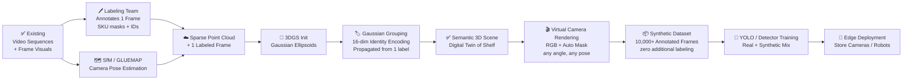

# Semantic 3D Retail Shelf Analytics

**One Label → 3D Scene → Unlimited Annotated Views**

This repository tracks the full engineering lifecycle of a retail AI system built on a core principle: **a human labeler annotates a single frame once, and the 3D pipeline automatically generates thousands of perfectly annotated training images** from every possible angle.

The system uses existing shelf video sequences to reconstruct a semantically-aware 3D Gaussian scene (digital twin). That scene becomes an infinite synthetic data factory — producing pixel-perfect labels for OOS detection, planogram compliance, and SKU recognition without any further human annotation effort.

---

## Table of Contents

1. [Project Overview](#project-overview)
2. [What We Already Have](#what-we-already-have)
3. [Pipeline Architecture](#pipeline-architecture)
4. [Step-by-Step Roadmap](#step-by-step-roadmap)
   - [Step 1 — Single-Frame Annotation by Labeling Team](#step-1--single-frame-annotation-by-labeling-team)
   - [Step 2 — Camera Pose Estimation (SfM) on Existing Sequences](#step-2--camera-pose-estimation-sfm-on-existing-sequences)
   - [Step 3 — Semantic 3DGS Training & Optimization](#step-3--semantic-3dgs-training--optimization)
   - [Step 4 — Synthetic Data Factory (Rendering Pipeline)](#step-4--synthetic-data-factory-rendering-pipeline)
   - [Step 5 — Downstream Model Training & Deployment](#step-5--downstream-model-training--deployment)
5. [Key Repositories](#key-repositories)
6. [Papers to Read](#papers-to-read)
   - [Core 3DGS & NeRF Foundations](#-core-3dgs--nerf-foundations)
   - [Semantic Scene Understanding in 3D](#-semantic-scene-understanding-in-3d)
   - [Structure-from-Motion & Camera Pose](#-structure-from-motion--camera-pose)
   - [Synthetic Data Generation](#-synthetic-data-generation)
   - [Retail Analytics & Downstream Applications](#-retail-analytics--downstream-applications)
7. [Hardware & Software Requirements](#hardware--software-requirements)
8. [Directory Structure](#directory-structure)
9. [Progress Tracker](#progress-tracker)

---

## Project Overview

We already have shelf video sequences and extracted frame visuals with product boxes visible in them. **No additional data collection is required.**

The bottleneck we solve is annotation cost and scale. Traditionally, every training image requires a human labeler. This project collapses that cost to a single annotation:

```
Human labeler annotates 1 frame  ──►  Labels lift into 3D space
                                              │
                              3D scene renders from 10,000+ viewpoints
                                              │
                          Each render has auto-generated pixel-perfect masks
                                              │
                              Production detector trains on this data
```

**The key technical mechanism:** Gaussian Grouping assigns a 16-dimensional identity vector to each 3D Gaussian primitive. Supervised by the one labeled frame, the 3D-KNN spatial regularizer propagates those identities through the entire scene — every product box becomes an independently addressable 3D object. From that point, rendering from any virtual camera angle automatically produces both the RGB frame and its exact segmentation mask, with mathematically correct occlusion handling via Z-buffer depth ordering.

**Target capabilities:**
- Out-of-Stock (OOS) detection in milliseconds
- Planogram compliance verification
- SKU-level instance segmentation from any camera angle
- Rapid onboarding of new products: label 1 frame → 3D → thousands of training samples in hours

---

## What We Already Have

| Asset | Status | Notes |
|-------|--------|-------|
| Shelf video sequences | ✅ Available | Multi-frame sequences from retail environment |
| Extracted frame visuals | ✅ Available | Individual frames with product boxes clearly visible |
| Product box instances | ✅ Visible in frames | Ready for annotation |
| Human labeling team | ✅ Available | Will annotate a single reference frame per scene |

**Starting point for the pipeline:** Step 1 (annotation of one frame) → directly into SfM → 3DGS.

---

## Pipeline Architecture



---

## Step-by-Step Roadmap

### Step 1 — Single-Frame Annotation by Labeling Team

**Goal:** Produce one pixel-accurate, SKU-labeled reference frame per scene. This is the **only human annotation required** for the entire pipeline.

| Task | Responsible | Tool | Output |
|------|-------------|------|--------|
| Select best reference frame | Engineering | Manual review | 1 representative frame per scene |
| Instance segmentation masks | Labeling team | CVAT / Label Studio / Roboflow | Per-product polygon masks |
| SKU ID assignment | Labeling team | Barcode reference or product catalog | `mask → SKU_ID` mapping |
| Quality check | Engineering | Mask overlap / coverage review | Validated annotation file |

**Format:** Export annotations in COCO JSON format (`images`, `annotations`, `categories`).

> **Why only 1 frame?**
> The 3D-KNN spatial regularizer in Gaussian Grouping propagates identity labels across the full 3D scene from even a single 2D supervision signal. The 3D geometry — reconstructed from the full video sequence — provides the structural context; the single label provides the semantic seed.

**Output:** `data/annotations/scene_XX_reference.json` + `data/keyframes/scene_XX_reference.jpg`

---

### Step 2 — Camera Pose Estimation (SfM) on Existing Sequences

**Goal:** Recover accurate 6-DoF camera poses from the existing video sequences to initialize the 3D scene.

| Scenario | Recommended Pipeline | Why |
|----------|----------------------|-----|
| Accuracy-first (default) | **GLUEMAP** (SALAD → MAST3R → COLMAP BA) | Eliminates false matches from repeating shelf patterns; handles texture repetition |
| Speed-first / edge use | **MV-DUSt3R+** | No pre-calibration; 2-second sparse reconstruction from sparse views |
| Fallback / validation | **COLMAP** vanilla | Well-established baseline for well-textured scenes |

> ⚠️ Vanilla COLMAP alone frequently drifts on retail corridors due to repeating product textures. GLUEMAP is strongly preferred.

**Key inputs:** Existing frame sequences from `data/sequences/`

**Output:** `models/sfm/` — camera intrinsics, extrinsics (`.txt` / `.bin`), sparse 3D point cloud (`.ply`)

---

### Step 3 — Semantic 3DGS Training & Optimization

**Goal:** Fuse the sparse point cloud geometry with the single labeled frame to build a fully semantic digital twin of the shelf.

**Architecture: Gaussian Grouping**

Each 3D Gaussian primitive is initialized from the SfM point cloud and receives:
- Standard geometric parameters (position $\mu$, scale $s$, rotation $q$, opacity $\alpha$, color SH coefficients)
- A **16-dimensional Identity Encoding vector** $\mathbf{e}_i$

During differentiable rasterization, the projected identity maps are supervised against the single labeled frame using:

$$\mathcal{L}_{total} = \mathcal{L}_{rgb} + \lambda_1 \mathcal{L}_{2D\text{-identity}} + \lambda_2 \mathcal{L}_{3D\text{-KNN}}$$

| Loss term | Role |
|-----------|------|
| $\mathcal{L}_{rgb}$ | Standard photometric reconstruction loss |
| $\mathcal{L}_{2D\text{-identity}}$ | Contrastive loss: Gaussians projecting into the same SKU mask share identity; those in different masks repel |
| $\mathcal{L}_{3D\text{-KNN}}$ | Spatial regularizer: neighboring Gaussians in 3D space are encouraged to share identities — this is what **propagates labels beyond the single labeled view** |

**Training time:** ~15–30 minutes on an A100/H100 GPU.

**Output:** `models/gaussian/scene_XX.ply` — every product box is now an independently addressable, semantically-labeled 3D object.

---

### Step 4 — Synthetic Data Factory (Rendering Pipeline)

**Goal:** Use the trained semantic scene to generate thousands of annotated training frames with zero additional human labor.

```python
# Conceptual rendering loop (Nerfstudio / gsplat API)
for virtual_camera_pose in sample_random_trajectories(n=10_000):
    rgb_frame   = render_scene(scene, virtual_camera_pose, mode="rgb")
    mask_frame  = render_scene(scene, virtual_camera_pose, mode="identity")
    bboxes_2d   = derive_bounding_boxes(mask_frame)          # exact, no human needed
    save(rgb_frame, mask_frame, bboxes_2d, sku_ids)
```

**Dual output per render:**
1. **RGB frame** — photorealistic image from the virtual viewpoint
2. **Identity mask** — pixel-perfect instance segmentation map, with correct occlusion handling via Z-buffer

**Why occlusion is solved:** When product A partially hides product B, the Z-buffer knows the exact 3D depth order of every Gaussian. The mask is generated from geometry, not guessed — impossible to get wrong.

**Augmentation strategies to maximize downstream model robustness:**
- Random virtual camera trajectories (angles impossible in real-world capture)
- SH coefficient perturbation to simulate different lighting conditions
- Virtual product removal to synthesize OOS (empty shelf) scenarios
- Gaussian displacement to simulate planogram violations

**Output:** `data/synthetic/` — `{rgb, instance_mask, bbox_coco.json, camera_pose}` per frame

---

### Step 5 — Downstream Model Training & Deployment

**Goal:** Train production-grade detection models on the synthetic dataset and deploy to edge hardware.

| Phase | Details |
|-------|---------|
| Dataset strategy | Synthetic frames + the original labeled frame (real-plus-synthetic mix) |
| Base model | YOLOv8 / YOLOv11 or RT-DETR |
| Expected training gain | Literature reports up to **+18% mAP** vs. real-data-only baselines |
| Quantization | INT8 / FP16 for edge deployment |
| Deployment targets | Store cameras, handheld terminals, autonomous shelf-scanning robots |

**Adding a new product (onboarding flow):**
1. Labeling team annotates the new product in 1 frame
2. Re-run Gaussian Grouping fine-tuning (~minutes)
3. Re-render synthetic data for the new SKU
4. Fine-tune the detector

**Target metrics:**
- OOS detection accuracy > 95%
- Planogram compliance verification < 100ms per shelf segment
- Robust generalization across lighting conditions and camera hardware

---

## Key Repositories

### 3D Reconstruction & Rendering
| Repository | Description |
|------------|-------------|
| [gaussian-grouping](https://github.com/lkeab/gaussian-grouping) | Segment and edit anything in 3D — core semantic 3DGS method |
| [nerfstudio](https://github.com/nerfstudio-project/nerfstudio) | Modular NeRF/3DGS framework; rendering pipeline and API |
| [gsplat](https://github.com/nerfstudio-project/gsplat) | Efficient 3DGS CUDA kernels; drop-in for training & rendering |
| [gaussian-splatting](https://github.com/graphdeco-inria/gaussian-splatting) | Original 3DGS implementation (Inria) |

### Camera Pose Estimation
| Repository | Description |
|------------|-------------|
| [colmap/gluemap](https://github.com/colmap/gluemap) | Global SfM + feedforward reconstruction hybrid |
| [colmap/colmap](https://github.com/colmap/colmap) | Classic Structure-from-Motion and MVS pipeline |
| [dust3r](https://github.com/naver/dust3r) | DUSt3R — geometric 3D vision without calibration |
| [mast3r](https://github.com/naver/mast3r) | MASt3R — improved matching for DUSt3R |

### Segmentation & Detection
| Repository | Description |
|------------|-------------|
| [segment-anything](https://github.com/facebookresearch/segment-anything) | SAM — zero-shot instance segmentation |
| [segment-anything-2](https://github.com/facebookresearch/segment-anything-2) | SAM 2 — video-level segmentation |
| [ultralytics](https://github.com/ultralytics/ultralytics) | YOLOv8 / YOLOv11 training & deployment |

### Retail-Specific
| Repository | Description |
|------------|-------------|
| [RetailGlue](https://openaccess.thecvf.com/content/CVPR2026W/IMW/papers/Oztuner_RetailGlue_Semantic_Product-Level_Image_Stitching_for_Retail_Shelf_Panoramas_CVPRW_2026_paper.pdf) | Semantic shelf panorama stitching (CVPR 2026 Workshop) |

---

## Papers to Read

### 📐 Core 3DGS & NeRF Foundations

| # | Paper | Venue | Link |
|---|-------|-------|------|
| 1 | **3D Gaussian Splatting for Real-Time Radiance Field Rendering** | SIGGRAPH 2023 | [arXiv](https://arxiv.org/abs/2308.04079) |
| 2 | **NeRF: Representing Scenes as Neural Radiance Fields** | ECCV 2020 | [arXiv](https://arxiv.org/abs/2003.08934) |
| 3 | **NeRF: A Comprehensive Review** | — | [arXiv](https://arxiv.org/html/2210.00379v6) |
| 4 | **3DGS vs NeRF: Side-by-Side Reconstruction Comparison** | Research Square | [PDF](https://assets-eu.researchsquare.com/files/rs-7300179/v1_covered_60fc3280-68ec-47c4-ae1d-228296ea12c4.pdf) |
| 5 | **From Fields to Splats: Cross-Domain Survey of Neural Scene Representations** | — | [arXiv](https://arxiv.org/html/2509.23555v1) |
| 6 | **VCR-GauS: View Consistent Depth-Normal Regularizer for Gaussian Surface Reconstruction** | NeurIPS 2024 | [PDF](https://proceedings.neurips.cc/paper_files/paper/2024/file/fc9f83d9925e6885e8f1ae1e17b3c44b-Paper-Conference.pdf) |
| 7 | **From Chaos to Clarity: 3DGS in the Dark** | OpenReview | [Link](https://openreview.net/forum?id=lWHe7pmk7C) |

### 🏷️ Semantic Scene Understanding in 3D

| # | Paper | Venue | Link |
|---|-------|-------|------|
| 8 | **Gaussian Grouping: Segment and Edit Anything in 3D Scenes** | ECCV 2024 | [arXiv](https://arxiv.org/html/2312.00732v2) · [ECVA](https://www.ecva.net/papers/eccv_2024/papers_ECCV/papers/04195.pdf) |
| 9 | **Semantic NeRF: In-Place Scene Labelling with Implicit Representation** | ICCV 2021 | [Project](https://shuaifengzhi.com/Semantic-NeRF/) · [CVF](https://openaccess.thecvf.com/content/ICCV2021/papers/Zhi_In-Place_Scene_Labelling_and_Understanding_With_Implicit_Scene_Representation_ICCV_2021_paper.pdf) |
| 10 | **Only Semantic Information For NeRF Reconstruction** | — | [arXiv](https://arxiv.org/html/2403.16043v1) |
| 11 | **R5DGS: Semantic-Aware 4D Gaussian Splatting** | OpenReview | [PDF](https://openreview.net/attachment?id=LFHg6tcn7e&name=pdf) |
| 12 | **BEA-GS: Beyond Radiance Supervision for Precise Object Extraction** | — | [arXiv](https://arxiv.org/html/2605.09662v1) |
| 13 | **Space-Time Forecasting with Motion-aware Gaussian Grouping** | CVPR 2026 | [CVF](https://openaccess.thecvf.com/content/CVPR2026/papers/Lee_Space-Time_Forecasting_of_Dynamic_Scenes_with_Motion-aware_Gaussian_Grouping_CVPR_2026_paper.pdf) |
| 14 | **Semantic Foam: Unifying Spatial and Semantic Scene Decomposition** | CVPR 2026 | [CVF](https://openaccess.thecvf.com/content/CVPR2026/papers/Sharafeldin_Semantic_Foam_Unifying_Spatial_and_Semantic_Scene_Decomposition_CVPR_2026_paper.pdf) |
| 15 | **SLAG: Scalable Language-Augmented Gaussian Splatting** | — | [arXiv](https://arxiv.org/html/2505.08124v2) |
| 16 | **VoteSplat: Hough Voting Gaussian Splatting for 3D Scene Understanding** | ICCV 2025 | [CVF](https://openaccess.thecvf.com/content/ICCV2025/papers/Jiang_VoteSplat_Hough_Voting_Gaussian_Splatting_for_3D_Scene_Understanding_ICCV_2025_paper.pdf) |
| 17 | **Beyond Averages: Open-Vocabulary 3D Scene Understanding with Gaussian Splatting** | — | [arXiv](https://arxiv.org/pdf/2509.12938) |
| 18 | **Group Any Gaussians via 3D-aware Memory Bank** | — | [arXiv](https://arxiv.org/html/2404.07977v3) |
| 19 | **Gradient-Weighted Feature Back-Projection: Fast Alternative to Feature Distillation in 3DGS** | — | [arXiv](https://arxiv.org/html/2411.15193v1) |
| 20 | **Unsupervised Continual Semantic Adaptation Through Neural Rendering** | CVPR 2023 | [CVF](https://openaccess.thecvf.com/content/CVPR2023/papers/Liu_Unsupervised_Continual_Semantic_Adaptation_Through_Neural_Rendering_CVPR_2023_paper.pdf) |
| 21 | **Learning Semantic Fields of Dynamic Scenes from Monocular Videos** | ICLR 2024 | [PDF](https://proceedings.iclr.cc/paper_files/paper/2024/file/801ec05b0aae9fcd2ef35c168bd538e0-Paper-Conference.pdf) |
| 22 | **SG-NeRF: Neural Surface Reconstruction with Scene Graph Optimization** | — | [arXiv](https://arxiv.org/html/2407.12667v1) |

### 🗺️ Structure-from-Motion & Camera Pose

| # | Paper | Venue | Link |
|---|-------|-------|------|
| 23 | **GLUEMAP: Global Structure-from-Motion Meets Feedforward Reconstruction** | CVPR 2026 | [GitHub](https://github.com/colmap/gluemap) · [Project](https://lpanaf.github.io/cvpr26_gluemap/) |
| 24 | **DUSt3R: Geometric 3D Vision Made Easy** | CVPR 2024 | [arXiv](https://arxiv.org/html/2312.14132v1) · [Semantic Scholar](https://www.semanticscholar.org/paper/DUSt3R%3A-Geometric-3D-Vision-Made-Easy-Wang-Leroy/5f82a81766cb78395a55b8fc697c2421a20f4a9e) |
| 25 | **MV-DUSt3R+: Single-Stage Scene Reconstruction from Sparse Views in 2 Seconds** | CVPR 2025 Oral | [Project](https://mv-dust3rp.github.io/) |
| 26 | **COLMAP-Free 3D Gaussian Splatting** | CVPR 2024 | [CVF](https://openaccess.thecvf.com/content/CVPR2024/papers/Fu_COLMAP-Free_3D_Gaussian_Splatting_CVPR_2024_paper.pdf) · [arXiv](https://arxiv.org/html/2312.07504v1) |
| 27 | **CT-NeRF: Incremental Optimizing NeRF and Poses with Complex Trajectory** | — | [arXiv](https://arxiv.org/html/2404.13896v2) |
| 28 | **Fast Intrinsic–Extrinsic Calibration for Pose-Only SfM** | Remote Sensing 2025 | [MDPI](https://www.mdpi.com/2072-4292/17/13/2247) |
| 29 | **Assessing COLMAP, DROID-SLAM, and NeRF-SLAM in 3D Road Scene Reconstruction** | Thesis | [PDF](https://lup.lub.lu.se/student-papers/record/9127302/file/9127313.pdf) |
| 30 | **Object-Centric Pose Estimation by Scale Alignment of Ray Diffusion and ICP** | Applied Sciences | [MDPI](https://www.mdpi.com/2076-3417/16/13/6624) |

### 🏭 Synthetic Data Generation

| # | Paper | Venue | Link |
|---|-------|-------|------|
| 31 | **Cut-and-Splat: Leveraging Gaussian Splatting for Synthetic Data Generation** | — | [arXiv](https://arxiv.org/html/2504.08473v1) |
| 32 | **Synthetic Dataset Generation for Autonomous Mobile Robots Using 3DGS** | — | [arXiv](https://arxiv.org/html/2506.05092v1) |
| 33 | **Efficient Synthetic Defect Generation Pipeline for Digital Twins** | PMC | [Link](https://pmc.ncbi.nlm.nih.gov/articles/PMC12656295/) |
| 34 | **Synthetic Data Generation for CV Tasks in SITL Systems with Unreal Engine** | — | [Link](https://nasu-periodicals.org.ua/index.php/its/article/view/22401) |

### 🛒 Retail Analytics & Downstream Applications

| # | Paper | Venue | Link |
|---|-------|-------|------|
| 35 | **RetailGlue: Semantic Product-Level Image Stitching for Retail Shelf Panoramas** | CVPR 2026 Workshop | [CVF](https://openaccess.thecvf.com/content/CVPR2026W/IMW/papers/Oztuner_RetailGlue_Semantic_Product-Level_Image_Stitching_for_Retail_Shelf_Panoramas_CVPRW_2026_paper.pdf) |
| 36 | **Enhanced Out-of-Stock Detection in Retail Shelf Images (Deep Learning)** | Sensors 2024 | [MDPI](https://www.mdpi.com/1424-8220/24/2/693) · [ResearchGate](https://www.researchgate.net/publication/377606706_Enhanced_Out-of-Stock_Detection_in_Retail_Shelf_Images_Based_on_Deep_Learning) |
| 37 | **StoreSketcher: Interactive Framework for Retail Scene Layout Planning** | CVM 2025 | [Link](https://www.sciopen.com/article/10.26599/CVM.2025.9450450) |

### 📚 Curated Reading Lists
| Resource | Link |
|----------|------|
| MrNeRF's Awesome 3DGS Paper List | [mrnerf.github.io](https://mrnerf.github.io/awesome-3D-gaussian-splatting/) |
| NAVER LABS 3D Foundation Models | [europe.naverlabs.com](https://europe.naverlabs.com/research/3d-foundation-models/) |

---

## Hardware & Software Requirements

### Compute (Training)
- GPU: NVIDIA A100 / H100 recommended (≥40GB VRAM for large scenes)
- RAM: ≥64GB system RAM
- Storage: ≥2TB NVMe (sequences + point clouds + Gaussian models + synthetic dataset)

### Core Software Stack
```
Python 3.10+
CUDA 11.8 / 12.x
PyTorch 2.x
nerfstudio / gsplat          # 3DGS training and rendering
COLMAP / GLUEMAP             # Camera pose estimation
gaussian-grouping            # Semantic identity encoding
ultralytics (YOLOv8+)        # Downstream detector training
Label Studio / CVAT          # Single-frame annotation UI
```

---

## Directory Structure

```
3D-retail-analytics/
│
├── 📄 README.md
├── 📄 requirements.txt
│
├── 📁 papers/                   # Downloaded PDFs, organized by category
│   ├── core-3dgs/
│   ├── semantic-3d/
│   ├── sfm-pose/
│   ├── synthetic-data/
│   └── retail-analytics/
│
├── 📁 data/
│   ├── sequences/               # ✅ Existing video sequences
│   ├── keyframes/               # ✅ Existing extracted frame visuals
│   ├── annotations/             # Step 1 output: single labeled frame per scene
│   │   └── scene_XX_reference.json   # COCO format: masks + SKU IDs
│   └── synthetic/               # Step 4 output: rendered dataset
│       ├── rgb/
│       ├── masks/
│       └── annotations_coco.json
│
├── 📁 models/
│   ├── sfm/                     # Step 2 output: camera poses, point clouds
│   ├── gaussian/                # Step 3 output: trained 3DGS scene files
│   └── yolo/                    # Step 5 output: trained downstream models
│
├── 📁 scripts/
│   ├── 01_annotate_reference_frame.md   # Labeling team instructions
│   ├── 02_run_sfm.sh                    # GLUEMAP / COLMAP pipeline
│   ├── 03_train_gaussian_grouping.sh    # 3DGS + identity encoding
│   ├── 04_render_synthetic_data.py      # Virtual camera rendering loop
│   └── 05_train_yolo.py                 # Downstream detector training
│
├── 📁 notebooks/                # Exploration and visualization
│
└── 📁 docs/
    └── project-plan-tr.docx     # Original Turkish project plan
```

---

## Progress Tracker

| Step | Status | Notes |
|------|--------|-------|
| Existing sequences & frames | ✅ Complete | Video sequences and frame visuals available |
| Step 1 — Single-Frame Annotation | 🔲 Not started | Labeling team: pick reference frame, annotate masks + SKU IDs |
| Step 2 — Camera Pose Estimation (SfM) | 🔲 Not started | Run GLUEMAP on existing sequences |
| Step 3 — Semantic 3DGS Training | 🔲 Not started | Gaussian Grouping; GPU environment setup needed |
| Step 4 — Synthetic Data Rendering | 🔲 Not started | Depends on Step 3 |
| Step 5 — YOLO Training & Deployment | 🔲 Not started | Depends on Step 4 |

---

## Citation

If this project builds on any of the referenced works, please cite the original authors. Key citations:

```bibtex
@article{ye2023gaussian,
  title={Gaussian Grouping: Segment and Edit Anything in 3D Scenes},
  author={Ye, Mingqiao and Danelljan, Martin and Yu, Fisher and Ke, Lei},
  journal={ECCV},
  year={2024}
}

@article{kerbl20233d,
  title={3D Gaussian Splatting for Real-Time Radiance Field Rendering},
  author={Kerbl, Bernhard and Kopanas, Georgios and Leimk{\"u}hler, Thomas and Drettakis, George},
  journal={ACM Transactions on Graphics},
  year={2023}
}

@inproceedings{wang2024dust3r,
  title={DUSt3R: Geometric 3D Vision Made Easy},
  author={Wang, Shuzhe and Leroy, Vincent and Cabon, Yohann and Chidlovskii, Boris and Revaud, Jerome},
  booktitle={CVPR},
  year={2024}
}
```

---

*Project initiated: July 2026 | Language: Python | License: MIT*
